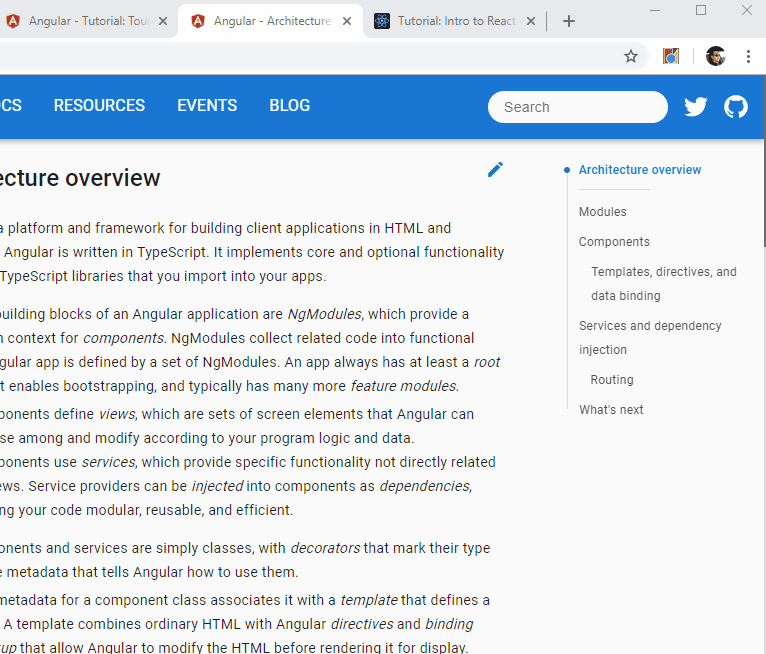

# ChromeExtensionAngularTabs

This project was generated with [Angular CLI](https://github.com/angular/angular-cli) version 7.2.2.

## General development steps
* create a new angular app with routing (ng new chrome-extension-angular-tabs)
* install the required packages by running command "npm install"
* create manifest.json in the angular src folder
* npm install --save firebase @angular/fire
* npm install --save @types/chrome
* npm install --save bootstrap
* npm install --save font-awesome

## Adding the Chrome Extension
* Update your Environment.ts file to include your "firebase" property with your apiKey and such.
  * Your apiKey can be found at `https://console.firebase.google.com/project/<your project>/overview`
* In command prompt, run `npm install` to install node dependencies
* Also in command prompt, run `ng build` to create your build files in the "dist" folder
* Enable developer mode in Chrome extensions (chrome://extensions/)
* Add your extension by clicking on `Load Unpacked` and referencing your "dist" output folder from "ng build"
* That's it! You should see the Chrome extension in your Chrome browser

## Special note
The default tsconfig.json and tsconfig.app.json files may not be structured in a manner that is compatible with browserify if you plan on using gulp to run task content-script for it's js file. After a bit of research, the format I have in this repo seems to work.

## Demo

## More information about Chrome Extensions
A Chrome Extension essentially needs an index.html and a manifest.json file as the minimum to run locally.
However, to create a fully feature extension we can use Angular as it is an easy framework to work with and enables us to use a variety of libraries quickly.
A few tweaks to the angular.json file to ensure your "outputPath", "index" and your "styles" and when you ng build your Angular application, it will be ready to be used as a Chrome Extension.

Reference:
* More information at: https://developer.chrome.com/extensions/getstarted
* Firebase console: https://console.firebase.google.com
* Firebase/Angular example: https://www.techiediaries.com/angular-firestore-tutorial/

## Code scaffolding
Run `ng generate component component-name` to generate a new component. You can also use `ng generate directive|pipe|service|class|guard|interface|enum|module`.
